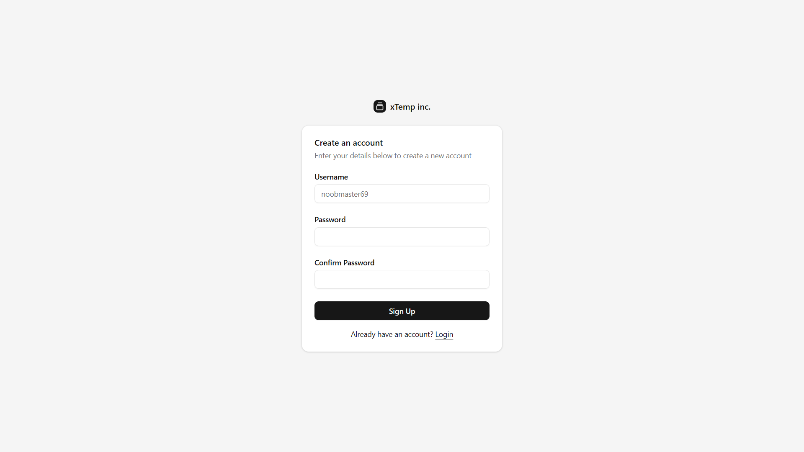
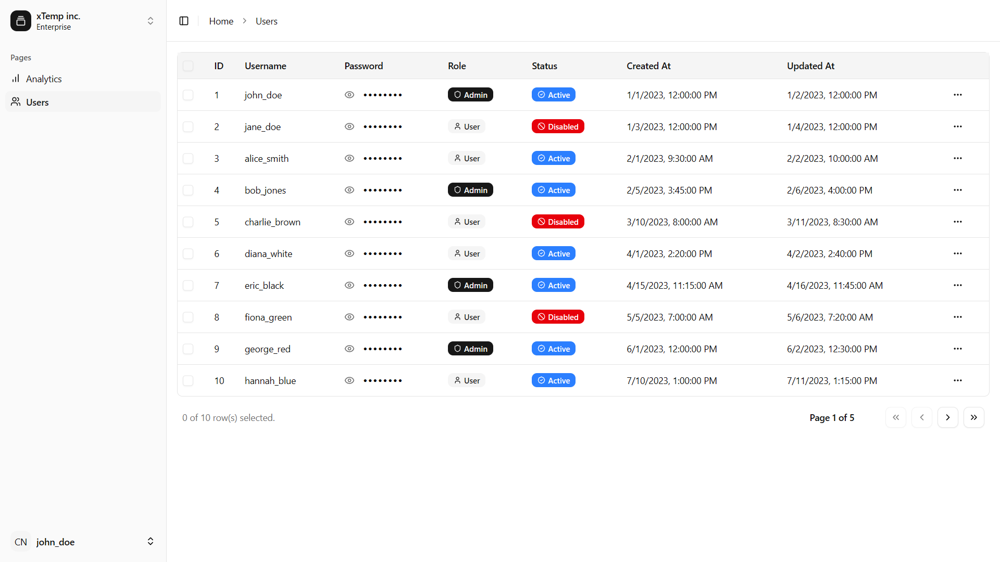

# User Management System

> 🧑‍💻 A full-stack user management system with role-based access control (RBAC), built with React, Spring Boot, MySQL, and Docker.
>
> Features admin CRUD operations and secure login for users via JWT double-token authentication.





## 🧠 Features

### ✅ Admin Features

- View all users
- Create new users
- Edit and delete users
- Role assignment (admin/user)

### 👤 User Features

- Secure login
- Access protected routes (based on role)
- Refresh token mechanism

### 🔐 Security

- JWT access + refresh token auth
- Spring Security filters and exception handling
- Role-based request validation

---

## 🧱 Tech Stack

### Frontend

- ⚛️ React 19
- 🧩 React Router DOM 7
- 💅 Tailwind CSS 4 + ShadCN
- ⚙️ React Hook Form + Zod
- 🔁 TanStack React Query
- 🔄 Axios with auth interceptor

### Backend

- 🌱 Spring Boot 3.4.x
- 🛠️ MyBatis Plus + JSQLParser
- 🐬 MySQL 8.4
- 🔑 JWT (Access & Refresh tokens)
- ⚙️ Lombok, Fastjson2, DevTools

---

## 🗃️ Database Schema

### `users`

| Column     | Type                 | Description            |
| ---------- | -------------------- | ---------------------- |
| id         | INT, PK              | Auto increment user ID |
| username   | VARCHAR(50), UNIQUE  | Login username         |
| password   | VARCHAR(255)         | Hashed password        |
| role       | ENUM('admin','user') | User role              |
| disabled   | BOOLEAN              | Account status         |
| created_at | DATETIME             | Record creation time   |
| updated_at | DATETIME             | Last update time       |

### `refresh_tokens`

| Column     | Type         | Description             |
| ---------- | ------------ | ----------------------- |
| id         | INT, PK      | Auto increment ID       |
| user_id    | INT, FK      | Linked to `users.id`    |
| token      | VARCHAR(512) | Refresh token string    |
| expires_at | DATETIME     | Token expiration time   |
| revoked    | BOOLEAN      | Token revocation status |

---

## 🏗️ Project Structure

```
.
├── client/               # React + Nginx
├── server/               # Spring Boot
├── database/             # MySQL Docker setup
├── docker-compose.yml    # Service orchestration
```
